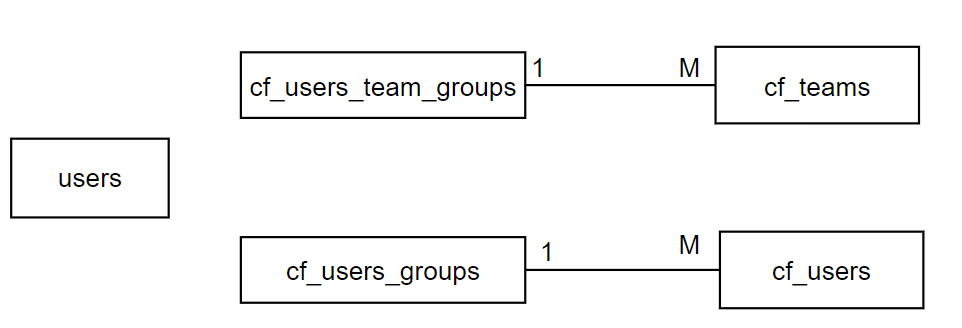

# Variant 1

## Таблицы

t_users:
1. id - pk, int 
2. c_login - not_null, unique, string
3. c_hashed_password - not null, string

t_cf_users_team_groups:
1. id - pk, int
2. c_user_id - fk на t_user (id), int
3. c_name - not null, string
4. с_time - not null, timestamp

t_cf_teams: hard_code
1. id - pk, int
2. c_first_user (login) - string
3. c_second_user (login) - string
4. c_third_user (login) - string
5. c_group_id - fk на t_cf_users_team_group (id), int
6. c_name - not null, string
7. c_description - string
8. с_time - not null, timestamp

t_cf_users_groups:
1. id - pk, int
2. c_user_id - fk на t_user (id), int
3. c_name -  not null, string
4. с_time - not null, timestamp

t_cf_users:
1. id - pk, int
2. c_cf_login - not null, string
3. c_cf_user_group_id - fk на t_cf_user_group(id), int
4. c_description - string
5. с_time - not null, timestamp

# Примерная схема (не самая красивая)

