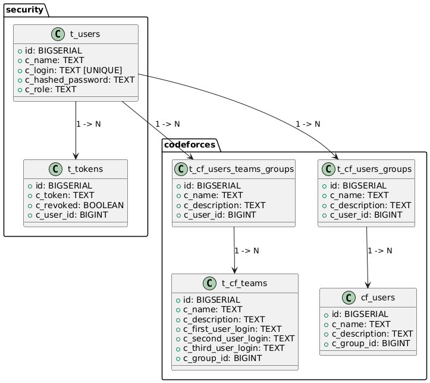

# Итоговая база данных
1. Решил разделить группы четко на 2 вида: группы команд и группа пользователей
2. Жестко принимаю, что в команде может быть до 3 человек (потому что на командных олимпиадах можно участвовать максимум 
втроем).
3. По хорошему стоило сделать дополнительные таблицы, может быть, объединить t_cf_users_groups и
t_cf_users_team_groups в одну таблицу. Однако я не до конца придумал, как обработать все случаи в таком виде. При 
этом у меня небольшое приложение, и считаю что текущее разбиение вполне подходит. Большая нормализация усложнит проект.
 